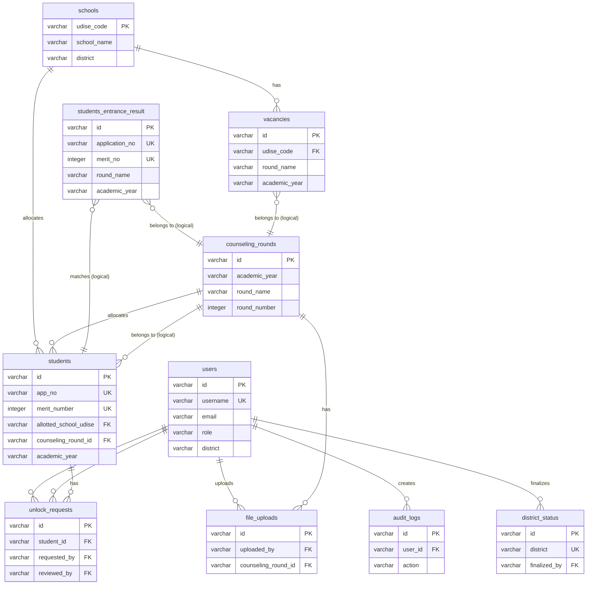

# Database Relationships - Neon DB

## Overview
This document describes all relationships between tables in the Station Allotment database, including foreign key relationships and logical relationships.

---

## Relationship Types

### One-to-Many (1:N) Relationships

#### 1. **users** → **audit_logs** (1:N)
- **Type**: One-to-Many
- **Foreign Key**: `audit_logs.user_id` → `users.id`
- **Description**: One user can create many audit log entries
- **Cascade**: None (nullable FK)
- **Example**: A user's login, file upload, allocation actions are logged

#### 2. **users** → **file_uploads** (1:N)
- **Type**: One-to-Many
- **Foreign Key**: `file_uploads.uploaded_by` → `users.id`
- **Description**: One user can upload many files
- **Cascade**: None (nullable FK)
- **Example**: Central admin uploads multiple student choice files

#### 3. **users** → **district_status** (1:N)
- **Type**: One-to-Many
- **Foreign Key**: `district_status.finalized_by` → `users.id`
- **Description**: One user can finalize many districts (typically one district admin per district)
- **Cascade**: None (nullable FK)
- **Example**: District admin finalizes their district

#### 4. **users** → **unlock_requests** (1:N) - Requested By
- **Type**: One-to-Many
- **Foreign Key**: `unlock_requests.requested_by` → `users.id`
- **Description**: One user can request many unlock requests
- **Cascade**: None (required FK)
- **Example**: District admin requests unlock for multiple students

#### 5. **users** → **unlock_requests** (1:N) - Reviewed By
- **Type**: One-to-Many
- **Foreign Key**: `unlock_requests.reviewed_by` → `users.id`
- **Description**: One user can review many unlock requests
- **Cascade**: None (nullable FK)
- **Example**: Central admin reviews multiple unlock requests

#### 6. **schools** → **vacancies** (1:N)
- **Type**: One-to-Many
- **Foreign Key**: `vacancies.udise_code` → `schools.udise_code`
- **Description**: One school can have many vacancies (different stream/gender/category combinations)
- **Cascade**: RESTRICT on delete, CASCADE on update
- **Example**: A school has Medical-Male-Open, Commerce-Female-Open, etc.

#### 7. **schools** → **students** (1:N)
- **Type**: One-to-Many
- **Foreign Key**: `students.allotted_school_udise` → `schools.udise_code`
- **Description**: One school can be allocated to many students
- **Cascade**: SET NULL on delete, CASCADE on update
- **Example**: A school receives multiple students after allocation

#### 8. **counseling_rounds** → **students** (1:N)
- **Type**: One-to-Many
- **Foreign Key**: `students.counseling_round_id` → `counseling_rounds.id`
- **Description**: One counseling round can allocate many students
- **Cascade**: SET NULL on delete, CASCADE on update
- **Example**: Round 1 allocates 100 students

#### 9. **counseling_rounds** → **file_uploads** (1:N)
- **Type**: One-to-Many
- **Foreign Key**: `file_uploads.counseling_round_id` → `counseling_rounds.id`
- **Description**: One counseling round can have many file uploads
- **Cascade**: None (nullable FK)
- **Example**: Multiple files uploaded for Round 1

#### 10. **students** → **unlock_requests** (1:N)
- **Type**: One-to-Many
- **Foreign Key**: `unlock_requests.student_id` → `students.id`
- **Description**: One student can have many unlock requests (history)
- **Cascade**: None (required FK)
- **Example**: Student has multiple unlock requests over time

---

## Logical Relationships (No Foreign Keys)

### Many-to-One (N:1) - Logical Links

#### 11. **students_entrance_result** ↔ **students** (N:1) - Logical
- **Type**: Many-to-One (Logical, via `application_no`)
- **Link Field**: `students_entrance_result.application_no` = `students.app_no`
- **Description**: Many entrance results can match one student (by application number)
- **Note**: No FK constraint, linked via application number matching
- **Example**: Entrance result with app_no "APP001" matches student with app_no "APP001"

#### 12. **students_entrance_result** ↔ **counseling_rounds** (N:1) - Logical
- **Type**: Many-to-One (Logical, via `roundName` and `academicYear`)
- **Link Fields**: 
  - `students_entrance_result.round_name` = `counseling_rounds.round_name`
  - `students_entrance_result.academic_year` = `counseling_rounds.academic_year`
- **Description**: Many entrance results belong to one counseling title (shared across all rounds)
- **Note**: Entrance results are shared across all rounds of the same counseling title
- **Example**: All entrance results for "First Counseling" are used in Round 1, Round 2, etc.

#### 13. **vacancies** ↔ **counseling_rounds** (N:1) - Logical
- **Type**: Many-to-One (Logical, via `roundName` and `academicYear`)
- **Link Fields**:
  - `vacancies.round_name` = `counseling_rounds.round_name`
  - `vacancies.academic_year` = `counseling_rounds.academic_year`
- **Description**: Many vacancies belong to one counseling title (shared across all rounds)
- **Note**: Vacancies are shared across all rounds of the same counseling title
- **Example**: All vacancies for "First Counseling" are used in Round 1, Round 2, etc.

#### 14. **students** ↔ **counseling_rounds** (N:1) - Logical (via roundName)
- **Type**: Many-to-One (Logical, via `roundName` and `academicYear`)
- **Link Fields**:
  - Students linked via `counseling_round_id` (FK) OR
  - Students linked via `roundName` and `academicYear` (logical)
- **Description**: Many students belong to one counseling title (shared across all rounds)
- **Note**: Students are shared across all rounds of the same counseling title
- **Example**: All students for "First Counseling" participate in Round 1, Round 2, etc.

---

## One-to-One (1:1) Relationships

### None - All relationships are one-to-many or many-to-one

---

## Many-to-Many (N:M) Relationships

### None - All relationships are one-to-many or many-to-one

---

## Standalone Tables (No Relationships)

### 1. **sessions**
- **Type**: Standalone
- **Description**: Session storage for Express sessions
- **Relationships**: None

### 2. **settings**
- **Type**: Standalone
- **Description**: System configuration settings
- **Relationships**: None

### 3. **district_status**
- **Type**: Standalone (except for `finalized_by` FK to users)
- **Description**: Tracks district finalization status
- **Relationships**: 
  - `finalized_by` → `users.id` (1:N)

---

## Relationship Summary Table

| Parent Table | Child Table | Relationship Type | Foreign Key | Cascade Delete | Cascade Update |
|--------------|-------------|-------------------|-------------|---------------|----------------|
| users | audit_logs | 1:N | user_id | None | None |
| users | file_uploads | 1:N | uploaded_by | None | None |
| users | district_status | 1:N | finalized_by | None | None |
| users | unlock_requests | 1:N | requested_by | None | None |
| users | unlock_requests | 1:N | reviewed_by | None | None |
| schools | vacancies | 1:N | udise_code | RESTRICT | CASCADE |
| schools | students | 1:N | allotted_school_udise | SET NULL | CASCADE |
| counseling_rounds | students | 1:N | counseling_round_id | SET NULL | CASCADE |
| counseling_rounds | file_uploads | 1:N | counseling_round_id | None | None |
| students | unlock_requests | 1:N | student_id | None | None |

---

## Logical Relationship Summary

| Table A | Table B | Relationship Type | Link Method |
|---------|---------|-------------------|-------------|
| students_entrance_result | students | N:1 (Logical) | application_no = app_no |
| students_entrance_result | counseling_rounds | N:1 (Logical) | roundName + academicYear |
| vacancies | counseling_rounds | N:1 (Logical) | roundName + academicYear |
| students | counseling_rounds | N:1 (Logical) | roundName + academicYear |

---

## Key Design Patterns

### 1. **Shared Data Pattern**
- **Entrance Results**, **Vacancies**, and **Students** are shared across all rounds of the same counseling title
- Linked via `roundName` (counseling title) and `academicYear`
- This allows data to be reused across multiple rounds

### 2. **Allocation Tracking**
- Students are linked to specific rounds via `counseling_round_id` when allocated
- This tracks which round a student was allocated in
- Students can participate in multiple rounds but are only allocated once

### 3. **School-Based Allocation**
- Vacancies are school-specific (via `udise_code`)
- Students are allocated to specific schools (via `allotted_school_udise`)
- This enables school-level tracking and reporting

### 4. **Audit Trail**
- All user actions are logged in `audit_logs`
- Links to users via `user_id`
- Provides complete activity tracking

---

## Visual ER Diagram

### Mermaid ER Diagram



### ASCII ER Diagram

```
┌─────────────┐
│    users    │
└──────┬──────┘
       │
       ├─────────────────────────────────────┐
       │                                     │
       ▼                                     ▼
┌──────────────┐                    ┌──────────────────┐
│ audit_logs   │                    │  file_uploads     │
└──────────────┘                    └────────┬──────────┘
       │                                     │
       │                                     │
       │                                     ▼
       │                            ┌──────────────────┐
       │                            │ counseling_rounds │
       │                            └────────┬───────────┘
       │                                     │
       │                                     ▼
       │                            ┌──────────────────┐
       │                            │    students      │
       │                            └────────┬──────────┘
       │                                     │
       │                                     ▼
       │                            ┌──────────────────┐
       │                            │ unlock_requests  │
       │                            └──────────────────┘
       │
       ▼
┌──────────────────┐
│ district_status  │
└──────────────────┘

┌─────────────┐
│   schools   │
└──────┬──────┘
       │
       ├──────────────────────┐
       │                      │
       ▼                      ▼
┌──────────────┐      ┌──────────────┐
│  vacancies   │      │   students   │
└──────────────┘      └──────────────┘

┌──────────────────────────┐
│ students_entrance_result  │ (Logical link to students via application_no)
└──────────────────────────┘
```

---

## Notes

1. **No Many-to-Many**: All relationships are one-to-many or many-to-one
2. **Logical Relationships**: Some relationships are logical (via matching fields) rather than enforced by foreign keys
3. **Shared Data**: Entrance results, vacancies, and students are shared across rounds of the same counseling title
4. **Cascade Behavior**: 
   - Schools → Vacancies: RESTRICT (cannot delete school with vacancies)
   - Schools → Students: SET NULL (can delete school, students lose school reference)
   - Counseling Rounds → Students: SET NULL (can delete round, students keep data)
5. **Nullable Foreign Keys**: Most FKs are nullable to allow data to exist without relationships

