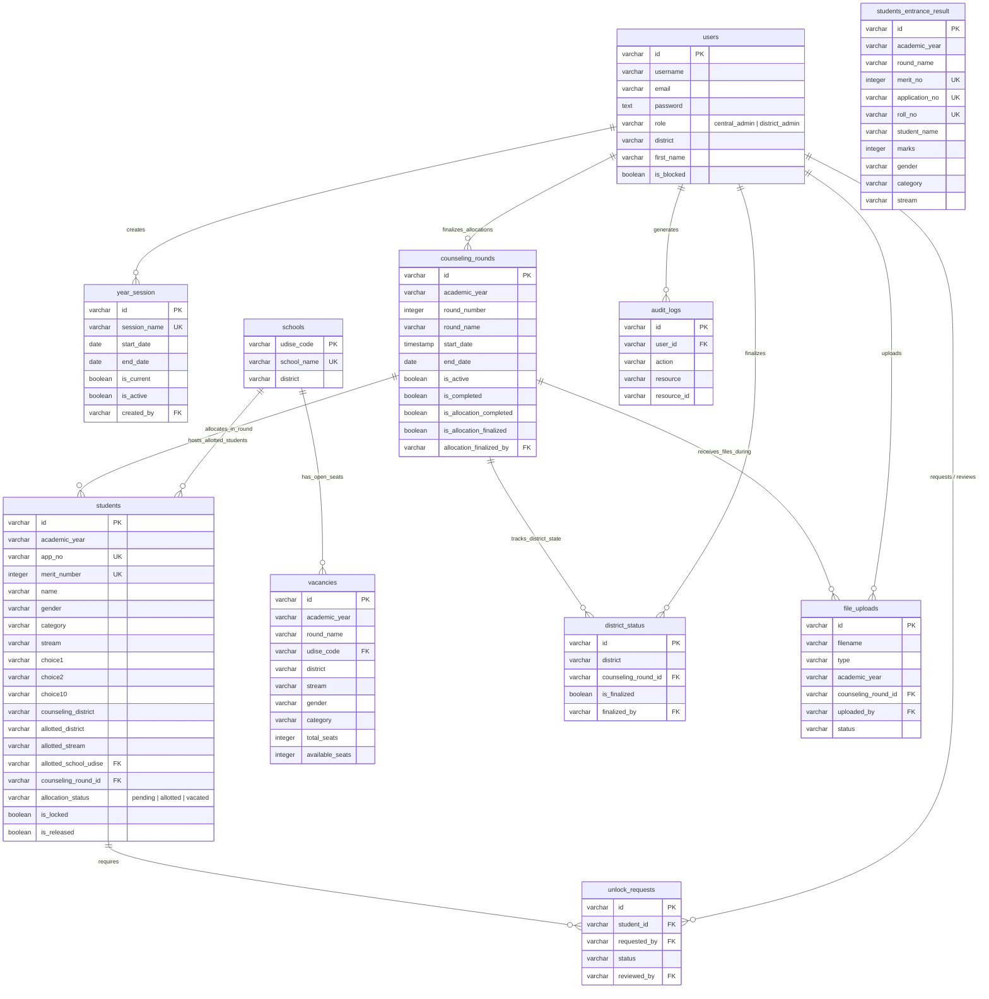

# Database Schema & Entity-Relationship (ER) Diagram

This document delineates the core Entity-Relationship architecture for the **Station Allotment** application, derived from the Drizzle ORM schema specifications.

## Entity-Relationship Diagram (Mermaid)

## Table Definitions & Relationships

### `users`
- **Purpose**: Tracks system identities, both `central_admin` (system-wide managers) and `district_admin` (focused on localized district inputs).
- **Relations**: 
  - Generates `audit_logs`.
  - Finalizes allocations in `counseling_rounds` and `district_status`.
  - Performs `file_uploads`.

### `year_session`
- **Purpose**: Forms the overarching "Academic Year" boundary (e.g., "2024-2025" or "2025-2026").
- **Notes**: Only one session is considered `isCurrent` at any time.

### `counseling_rounds`
- **Purpose**: Defines an iteration of the counseling process (e.g., Round 1, Round 2) within a specific academic year. 
- **Notes**: Allocations and status tracking happen relative to the active `CounselingRound`.

### `schools`
- **Purpose**: Static directory of physical schools located across 10 specific Punjab districts.
- **Relations**: Uniquely identified by `udiseCode`, which forms a Foreign Key relationship with `vacancies` and `students` (as `allottedSchoolUdise`).

### `students` & `students_entrance_result`
- **Purpose**: `students` holds dynamic user preference configurations, lock states, and final allocation assignments. `students_entrance_result` logs the raw, immutable merit test results imported by CSV.
- **Relations**: A student may be linked to a `school` upon allocation, and their allocation happens relative to a `counseling_round_id`.

### `vacancies`
- **Purpose**: Tracks available seats in specific schools per stream, gender, and category matrix.
- **Notes**: Contains dynamically updated `availableSeats` which deduct automatically upon `student` allocation, and restore upon "vacated" status.

### `district_status`
- **Purpose**: Tracks whether a `district_admin` has completely finished locking all student choices under their jurisdiction *for a specific counseling round*.

### Utilities (`file_uploads`, `audit_logs`, `settings`)
- Tracks user operations, CSV imports, security actions, and raw string configurations.
