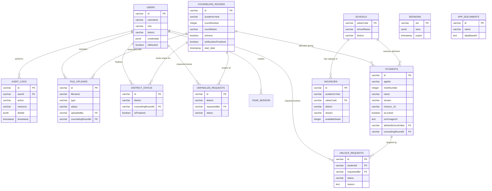

# ER Diagram - Station Allotment System

This diagram illustrates the relationships between the core entities in the Station Allotment database.

## Entity Descriptions

- **USERS**: System administrators (Central and District).
- **STUDENTS**: Core student data including their merit, preferences (1-10), and allotment results.
- **SCHOOLS**: Master list of schools with UDISE codes.
- **VACANCIES**: Available seats per school, stream, gender, and category.
- **COUNSELING_ROUNDS**: Defines specific phases of the allocation process.
- **DISTRICT_STATUS**: Tracks whether a district has finalized their allocations for a specific round.
- **UNLOCK/UNFINALIZE_REQUESTS**: Workflow entities for requesting administrative overrides.
- **AUDIT_LOGS**: Comprehensive tracking of all administrative actions for compliance.
- **APP_DOCUMENTS**: Storage for static system assets like flow diagrams.
