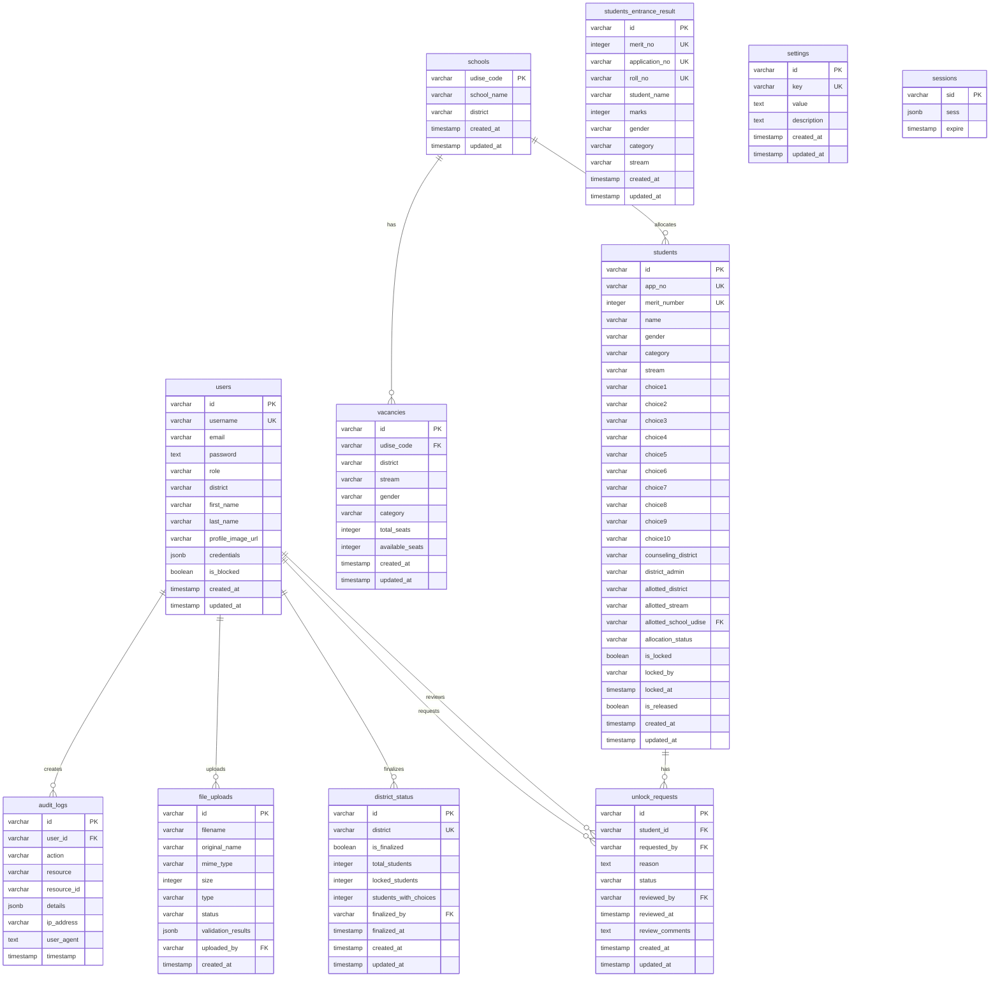

# Database Schema - ER Diagram

## Mermaid ER Diagram

## Table Relationships

### Primary Relationships:
1. **users** → **audit_logs** (one-to-many): Users create audit log entries
2. **users** → **file_uploads** (one-to-many): Users upload files
3. **users** → **district_status** (one-to-many): Users finalize districts
4. **users** → **unlock_requests** (one-to-many): Users request/review unlock requests
5. **schools** → **vacancies** (one-to-many): Schools have multiple vacancies
6. **schools** → **students** (one-to-many): Schools allocate students
7. **students** → **unlock_requests** (one-to-many): Students have unlock requests

### Unique Constraints:
- **vacancies**: `UNIQUE(udise_code, stream, gender, category)` - One vacancy per school/stream/gender/category combination
- **users**: `UNIQUE(username)` - Unique username
- **students**: `UNIQUE(app_no)`, `UNIQUE(merit_number)` - Unique application and merit numbers
- **students_entrance_result**: `UNIQUE(merit_no)`, `UNIQUE(application_no)`, `UNIQUE(roll_no)` - Unique identifiers
- **district_status**: `UNIQUE(district)` - One status per district
- **settings**: `UNIQUE(key)` - Unique setting keys

### Foreign Key Constraints:
- **vacancies.udise_code** → **schools.udise_code** (RESTRICT on delete, CASCADE on update)
- **students.allotted_school_udise** → **schools.udise_code** (SET NULL on delete, CASCADE on update)
- **audit_logs.user_id** → **users.id**
- **file_uploads.uploaded_by** → **users.id**
- **district_status.finalized_by** → **users.id**
- **unlock_requests.student_id** → **students.id**
- **unlock_requests.requested_by** → **users.id**
- **unlock_requests.reviewed_by** → **users.id**

## Indexes

### Performance Indexes:
- `idx_schools_district` on `schools(district)`
- `idx_vacancies_udise_code` on `vacancies(udise_code)`
- `idx_vacancies_district` on `vacancies(district)`
- `idx_students_allotted_school_udise` on `students(allotted_school_udise)`
- `IDX_session_expire` on `sessions(expire)`

## Notes

- **UDISE Code**: Unique identifier for schools (11 digits)
- **Allocation**: Students are allocated to specific schools via `allotted_school_udise`
- **Vacancies**: Tracked at school level (one record per school/stream/gender/category)
- **Session Management**: Uses `connect-pg-simple` for session storage

